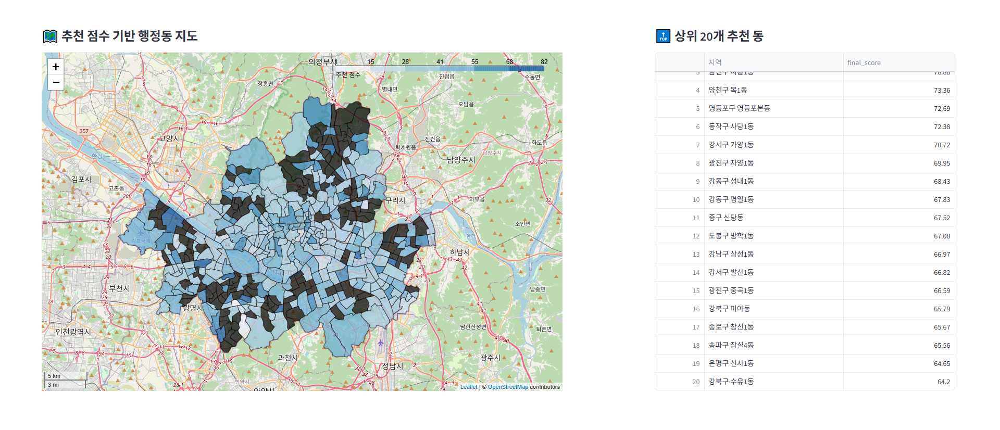
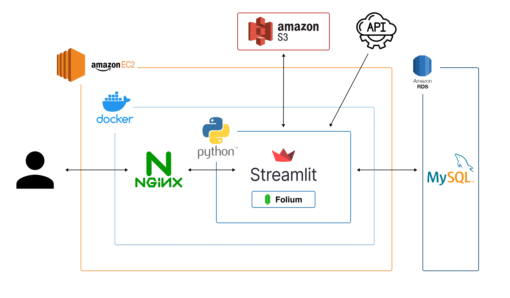
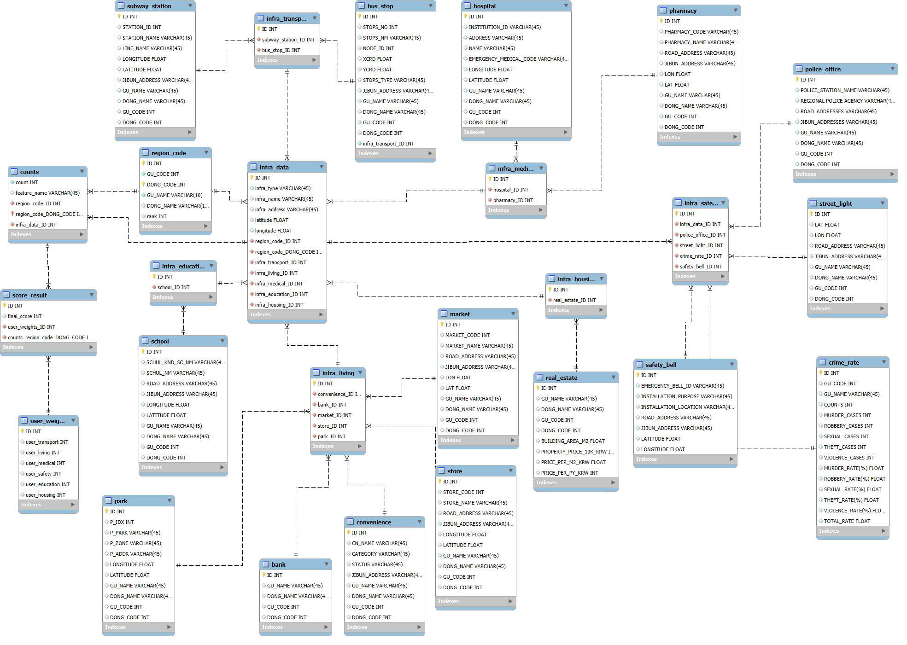
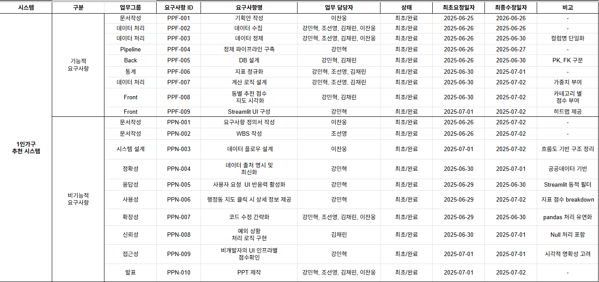

# PICK-YOUR-PLACE
---

## 💡 프로젝트 주제  
서울시로 이사·이주를 고려하는 많은 사람들을 위한 적합한 거주지를 추천 시스템

---

## 📅 프로젝트 일정
- 프로젝트 기간 : 2025.06.26 ~ 2025.07.02

| 날짜            | 주요 작업                          | 담당자               |
|-----------------|-----------------------------------|----------------------|
| 06.26           | 아이디어 회의, 기획안 초안 작성       | 전원 참여             |
| 06.26~06.27     | 데이터 수집 및 정제, 단위 정의        | 김채린, 이찬웅, 강민혁, 조선영 |
| 06.27~06.30     | 통계 로직 설계 (범죄, 교통 등 6종)     | 각 항목별 담당자        |
| 06.30           | 최종 점수 계산 및 DB 저장            | 강민혁               |
| 07.01           | Streamlit 기반 프론트 UI 구현        | 강민혁               |
| 07.01           | 지도 시각화 구현                    | 김채린               |
| 07.01           | 백엔드 지역 추천 로직 완성            | 이찬웅               |
| 07.01           | 예외 상황 대응 및 입력값 테스트        | 김채린, 조선영         |
| 07.01~07.02     | PPT 제작, 발표 준비                  | 전체                 |
| 07.02           | 최종 발표                            | 전체                 |

---

## 👥 팀원 소개

| 이름     | 주요 역할                                                   |
|----------|-------------------------------------------------------------|
| 강민혁   | 팀장 - 데이터 수집 및 정제 - 주소변환 로직 설계 - 데이터 정의서 작성 - DB 설계 - 아키텍처 설계 - 인터페이스 구현 |
| 김채린   | - 데이터 수집 및 정제 - 지역 추천 로직 설계 - 점수 계산 모형 설계 |
| 이찬웅   | - 데이터 수집 및 정제 - 요구사항정의서 작성 - 플로우차트 작성 - GIT README 작성 - 기획안 작성 |
| 조선영   | - 데이터 수집 및 정제 - 부동산 거래가 로직 설계 - WBS 작성 - 데이터 연동 정의서 작성 - PPT 제작 |

---

## 📌 서비스 소개  
서울시로 이주하려는 시민들을 대상으로, 다양한 인프라 요소(교통, 의료, 교육, 생활, 안전, 주거 등)를 종합 분석하여 맞춤형 거주지 추천 서비스를 제공하는 플랫폼

각 행정동 단위로 수집된 데이터를 대상으로 반영한 가중치를 점수 기반의 분석을 통해 거주지의 종합 점수를 시각적으로 비교 가능.

Streamlit과 GeoPandas를 활용한 웹 대시보드 상에서 서울시 지도를 기반으로 원하는 동을 선택, 해당 지역의 인프라 지표와 추천 점수를 한눈에 확인할 수 있도록 구성.

이 시스템은 1인 가구나 특정 연령층이 아닌, 서울로 이사하는 일반 시민 누구나 객관적인 기준으로 거주지를 탐색할 수 있도록 설계

- 사용자의 중요도를 고려한 카테고리를 선택 

- 추천점수를 기반으로 행정동의 지역을 명도로 표현

- 선택한 행정동의 인프라 정보 전달

---

## 🗂️ 사용 기술 스택

## 🛠 기술 스택

| 분야       | 기술명                             |
|------------|--------------------------------------|
| 언어       | [Python](https://www.python.org)     |
| 시각화     | [Streamlit](https://streamlit.io)    |
| 지도처리   | [GeoPandas](https://geopandas.org)   |
| 데이터 처리| [Pandas](https://pandas.pydata.org) |
| 데이터베이스 | [SQLite](https://www.sqlite.org)    |
| 공공 API   | [VWorld](https://www.vworld.kr) / [서울 열린데이터광장](https://data.seoul.go.kr) |
| 버전관리   | [Git](https://git-scm.com) / [GitHub](https://github.com) |
| 협업 툴    | [Notion](https://www.notion.so) / [draw.io](https://draw.io) |

# 시스템 아키텍쳐

---
## 🧱 데이터 설계

### 📌 1) 데이터 구조 및 수집

- 서울시 공공데이터 기반 인프라 수집 (CSV, API)
- 주요 항목: 교통, 의료, 교육, 생활편의시설, CCTV, 주거시세 등

  # DataBase E-R Diagram
  - 전처리 된 데이터들의 컬럼들에 PK, FK을 부여
  

### ⚖️ 2) 데이터 가중치 반영

- 사용자 설정에 따라 6가지 인프라 항목별 가중치 입력 가능
- 기본값은 국민 주거 선호도 통계 기반 (입소스피앰아이 설문)

### 🎯 3) 점수 계산 로직

- 각 항목 정규화 후 가중합 계산
- 행정동 단위로 집계하여 종합 점수 도출
- 종합 점수 기준으로 상위 10개 동 추천

---
## WBS
- 순차적인 진행상황 시각화

---

## 📌 요구사항 정의서

- 기능 및 비기능 요구사항 포함
- 데이터 수집, 정제, 가중치 설정, 지도 시각화, UI 요구사항 등 명세화

---

## 🔁 플로우 차트

- 데이터 수집 → 전처리 → DB 저장 → 점수화 → 시각화 흐름
- 사용자 입력 기반 필터링 → 추천 동 리스트 → 상세정보 제공

---
## 🧪 주요 기능

- 행정동별 인프라 비교 점수 확인
- 상위 10개 동 추천
- 서울시 지도 클릭 시 지역별 세부 정보 제공

---

✅ 기대 효과
- 데이터 기반 의사결정 지원: 수집된 데이터를 정량적으로 분석하여 정책 및 서비스 개선 방향 제시

- 사용자 맞춤형 서비스 제공: 개인별 요구와 조건에 따른 맞춤형 추천 또는 정보 제공 가능

- 사회 문제 해결 기여: 청년 주거, 안전, 교통 등 실생활 문제에 대한 구체적 솔루션 제안

- 공공 데이터 활용 활성화: 서울시 및 국가 공공 데이터를 적극 활용하여 사회적 가치 창출

- 향후 확장 가능성 확보: 타 지역·타 대상군으로의 확장 및 다른 서비스와의 연계 가능성 내재

---

## 📊 사용 데이터/API 목록

| 번호 | 데이터명 | 출처 링크 | 설명 |
|------|----------|-----------|------|
| 1 | 서울시 5대 범죄 발생현황 통계 | [바로가기](https://data.seoul.go.kr/dataList/316/S/2/datasetView.do) | 자치구별 범죄 통계 |
| 2 | 서울시 인구밀도 통계 | [바로가기](https://data.seoul.go.kr/dataList/10584/S/2/datasetView.do) | 서울시 인구 밀도 정보 |
| 3 | 서울시 대규모점포 인허가 정보 | [바로가기](https://data.seoul.go.kr/dataList/OA-16096/S/1/datasetView.do) | 대형마트, 백화점 등 유통시설 위치 |
| 4 | 서울시 휴게음식점 인허가 정보 | [바로가기](https://data.seoul.go.kr/dataList/OA-16095/S/1/datasetView.do) | 카페, 분식집 등 식음료 매장 위치 |
| 5 | 서울시 금융기관 통계 | [바로가기](https://data.seoul.go.kr/dataList/10129/S/2/datasetView.do) | 은행, 금융기관 수 및 위치 |
| 6 | 편의점 | [바로가기](https://safemap.go.kr/opna/data/dataView.do?objtId=145) | 전국 편의점 위치 정보 |
| 7 | 전통시장현황 | [바로가기](https://www.data.go.kr/data/15052837/fileData.do) | 전국 전통시장 위치 정보 |
| 8 | 경찰서 | [바로가기](https://www.data.go.kr/data/15124966/fileData.do) | 전국 경찰서 위치 정보 |
| 9 | 서울시 병의원 위치 정보 | [바로가기](https://data.seoul.go.kr/dataList/OA-20337/S/1/datasetView.do) | 병원 및 의원 위치 정보 |
| 10 | 서울시 병원 인허가 정보 | [바로가기](https://data.seoul.go.kr/dataList/OA-16479/S/1/datasetView.do) | 병원 인허가 기반 상세 정보 |
| 11 | 서울시 학교 기본정보 | [바로가기](https://data.seoul.go.kr/dataList/OA-20502/S/1/datasetView.do) | 초·중·고 등 학교 위치 |
| 12 | 서울시 자치회관 현황 | [바로가기](https://data.seoul.go.kr/dataList/OA-21246/F/1/datasetView.do) | 자치회관(공공시설) 위치 정보 |
| 13 | 서울시 주요 공원현황 | [바로가기](https://data.seoul.go.kr/dataList/OA-394/S/1/datasetView.do) | 대형 공원 위치 및 면적 정보 |
| 14 | 버스정류소 정보 | [바로가기](https://data.seoul.go.kr/dataList/OA-15067/S/1/datasetView.do) | 서울시 버스정류장 위치 정보 |
| 15 | 지하철역 좌표정보 | [바로가기](https://t-data.seoul.go.kr/category/dataviewopenapi.do?data_id=1036) | 지하철역 위치 좌표 정보 |
| 16 | 전국 안전비상벨 위치 데이터 | [바로가기](https://www.data.go.kr/data/15028206/standard.do) | 비상벨 설치 위치 정보 |
| 17 | 서울시 안심이 CCTV 연계 현황 | [바로가기](https://data.seoul.go.kr/dataList/OA-20923/S/1/datasetView.do) | CCTV 설치 위치 및 수량 |
| 18 | 서울특별시 가로등 위치 정보 | [바로가기](https://www.data.go.kr/data/15107934/fileData.do) | 가로등 위치 및 설치 목적 |
| 19 | 서울시 부동산 전월세가 정보 | [바로가기](https://data.seoul.go.kr/dataList/OA-21276/S/1/datasetView.do) | 전세/월세 가격 정보 |
| 20 | 서울시 부동산 실거래가 정보 | [바로가기](https://data.seoul.go.kr/dataList/OA-21275/S/1/datasetView.do) | 매매 실거래가 정보 |
| 21 | 행정동 경계 GeoJSON | [바로가기](https://github.com/vuski/admdongkor) | 법정동/행정동 경계 지도 (GeoJSON 포맷) |
| 22 | 행정동/법정동 코드 데이터 | [바로가기](https://www.mois.go.kr/frt/bbs/type001/commonSelectBoardArticle.do?bbsId=BBSMSTR_000000000052&nttId=118603) | 주소 매핑 및 코드 변환용 기준 데이터 |

---

## 🔍 참고 링크

- [🔗 GitHub 저장소](https://github.com/lgup6-2nd-project/pick-your-place)
- [📝 Notion 문서](https://www.notion.so/2-21ede793ce9b8085a10beef9fdae0788?p=21fde793ce9b80fba1fad43b312bbeb7&pm=s)

